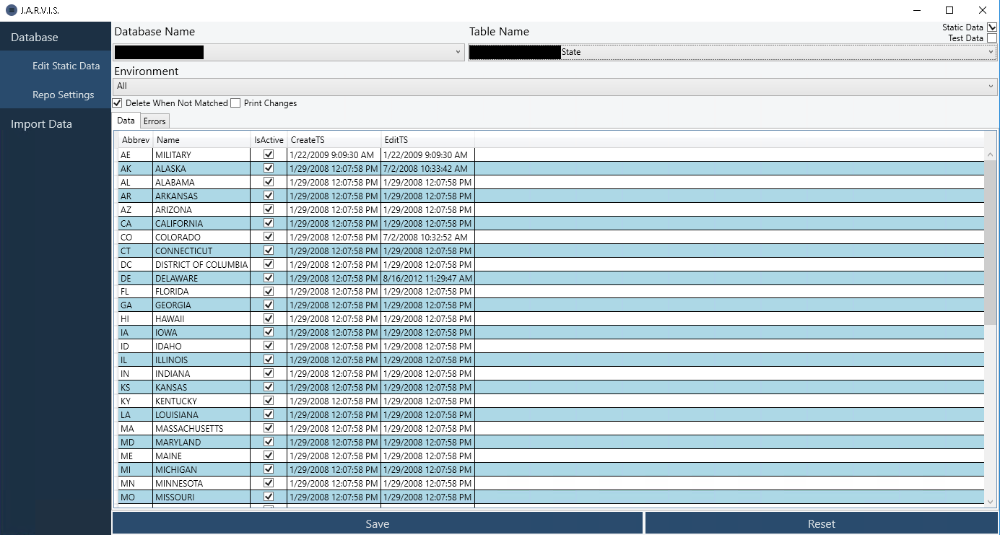

# Jarvis
Jarvis was built as a way to manage static data files for automated database deployment with SqlPackage. Static data deployment is still in progress by Microsoft, and as yet is not supported.

Jarvis parses static data files created using [generate-sql-merge](https://github.com/readyroll/generate-sql-merge/blob/master/master.dbo.sp_generate_merge.sql) and provides a nice interface for modifying the data. Some features include automatically detecting data types while editing, updating edit time stamps, and more. 

## Screenshot


## Automated Deploy
Static data merge scripts can be added to the PostDeployment.sql file in the database project (see [SQLCMD](https://docs.microsoft.com/en-us/sql/ssms/scripting/edit-sqlcmd-scripts-with-query-editor?redirectedfrom=MSDN&view=sql-server-ver15)).

### Example
PostDeploy.sql
``` sql
-- Include static data
:R _Data\Static\All\Schema.Table.sql
...
```

## Configuration
Create a normal database project using Visual Studio, and then add a `_Data/Static/{Environment}` folder to the project to store static data files. Files can be organized in subfolders which represent different environments.

### Sample
* Database Project
    * _Data
        * Static
            * All
                * Schema.Table.sql
            * Development
            * Test
            * ...
            
### Data files
Static data files are built using merge scripts created with [generate-sql-merge](https://github.com/readyroll/generate-sql-merge/blob/master/master.dbo.sp_generate_merge.sql). Simply insert the output from that query into the sql file for the desired table.
